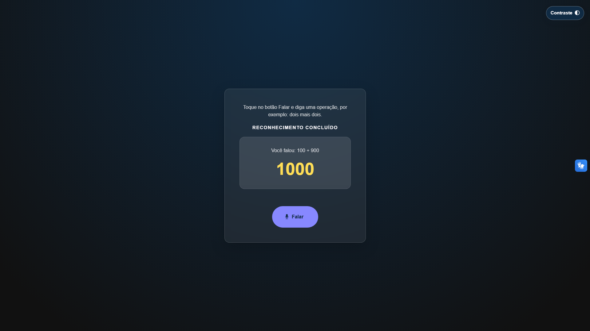
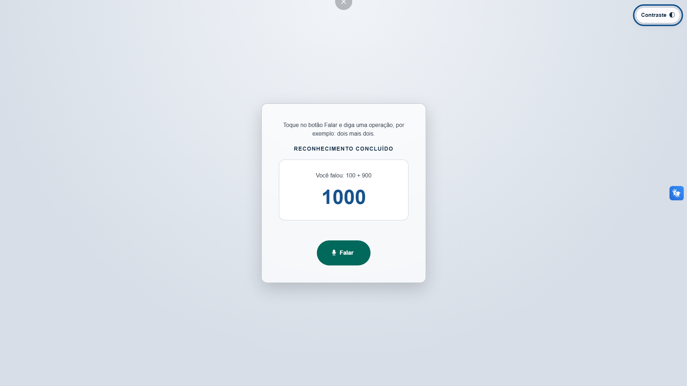
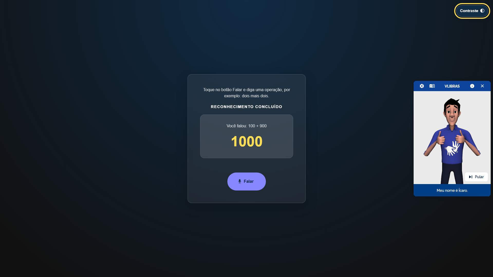

# Calculadora por Voz Acessível

Projeto desenvolvido para a faculdade com foco em acessibilidade e reconhecimento de voz.

A proposta é permitir que o usuário fale uma operação matemática básica e receba o resultado na tela e também por voz.

## Preview

### 🌙 Modo escuro


### ☀️ Modo claro


### ♿ Integração com VLibras


## Funcionalidades

- Reconhecimento de voz em português
- Resposta por voz com o resultado
- Operações básicas:
  - adição
  - subtração
  - multiplicação
  - divisão
- Suporte a números:
  - digitados (quando reconhecidos pela fala)
  - por extenso
  - grandes (ex: 10.000)
  - negativos
  - decimais com vírgula
- Modo claro e escuro
- Persistência do tema com `localStorage`
- Integração com VLibras
- Melhorias de acessibilidade com ARIA
- Navegação por teclado
- Link de pular para a calculadora
- Tratamento de erros, como:
  - operação inválida
  - divisão por zero
  - microfone não encontrado
  - permissão negada
  - ausência de fala

## Exemplos de comandos

Você pode falar operações como:

```txt
dez mais dois
vinte e dois menos três
dez dividido por dois
cinco vezes quatro
dez mil mais dez mil
dez vírgula cinco mais dois vírgula cinco
menos dez mais dois
```

## Acessibilidade

O projeto possui recursos voltados para acessibilidade web, como:

- estrutura semântica com main, section e h1
- mensagens dinâmicas com aria-live
- botões com rótulos acessíveis
- foco visível para navegação por teclado
- suporte a prefers-reduced-motion
- contraste ajustado nos modos claro e escuro
- integração com VLibras

O projeto foi testado com a ferramenta WAVE, não apresentando erros críticos de acessibilidade.

## Tecnologias utilizadas

- HTML5
- CSS3
- JavaScript
- Bootstrap Icons
- VLibras
- Web Speech API

## Como usar

1. Abra o projeto no navegador.
2. Clique no botão **Falar**.
3. Diga uma operação matemática.
4. O resultado será exibido na tela e falado pelo sistema.

## Observação

O reconhecimento de voz depende do suporte do navegador e da permissão de uso do microfone.